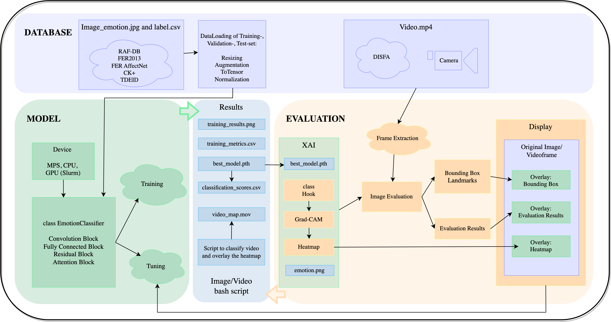

# GiMeFive✋: Towards Interpretable Facial Emotion Classification

## Abstract

## Overview



## Results

## Where is our final report 📄?

## Where are our slides 🎥?

On [goolge docs](https://docs.google.com/presentation/d/14AazB5FY5jLyB5-9R6Ix7LoMX8yNR_illDAaYDCm8_s/edit#slide=id.g2b4d85efaed_0_31). 
The shared link is available [here](https://docs.google.com/presentation/d/14AazB5FY5jLyB5-9R6Ix7LoMX8yNR_illDAaYDCm8_s/edit?usp=sharing). 
The PDF Version is [here](https://github.com/werywjw/SEP-CVDL/blob/main/presentation/SEP-CVDL.pdf).

## Where is our proposal (preliminary report) 📃?

The PDF Version is [here](https://github.com/werywjw/SEP-CVDL/blob/main/proposal/Emotion%20Recognition%20From%20Facial%20Expressions%3A%20A%20Preliminary%20Report.pdf).

## How to generate a requirements.txt?
```
pipreqs /Users/wery/Desktop/SEP-CVDL
pipreqs /Path/to/the/repository/SEP-CVDL
```

## Requirements

A detailed list of requirements can be found in `requirements.txt`. 

```
pip install -r requirements.txt
python3 -m pip install -r requirements.txt
```

## How to run the script to get the CSV file of classification scores?
Please change the **filepath** to the image folder that you would like to try. 😄

- Option 1️⃣: Run the following command:
```
python3 script_csv.py 'dataset/validation_set'
```

- Option 2️⃣: Use shell:
```
./script_csv.sh
```

## How to run the script to the video?

TODO

## How does our video look like?


## How to test the live Demo with camera?

Run the following command:
```
python3 livecam.py
```

Exit via `control` + `C`

## How to resolve the conflicts?
```
git status
```
See what is asked to be modified, then:
```
git add .
git pull 
git commit
git push
```

## How to coauthor?

```
git add .
git commit -m "


Co-authored-by: leahkawka <leahkawka@gmail.com>"
git push origin main
```

Similarly, `command` + `enter` for blank lines:
```
git commit -m " <balala>


Co-authored-by: werywjw <werywjw@gmail.com>"
```

## How to convert `.ipynb` to `.py`?

```
colab-convert livecam.ipynb livecam.py -nc -rm -o
```

## How to create the virtual environment?

```
source /Users/wery/venv/bin/activate
```

## Notes on Slurm

1. get your CIP account information 
2. activate romote access
3. git bash (ssh included) on windows / go to Terminal on MacBook
4. Login to remote host: (e.g., name lachen) command:
```
ssh <cip-kennung>@remote.cip.ifi.lmu.de
```
 + password
ok everthing

5. command:
```
sinfo | grep Nvidia2060
```

6. go to Nvidia2060 host, get there by picking one of the names listed after idle 
command: 
```
ssh <cip-kennung>@<server_name>
```
(e.g., ssh <cip-kennung>@chondrit, ssh <cip-kennung>@idle) asked to type yes + enter password

7. to get information of the server architechtur, 
Linux terminal command: lsb_release -a
get info of graphiccard command: nvidia-smi
list of python versions: 
kawka@chondrit:~ (0) [15:43:07] % python --version  
Python 2.7.18  
kawka@chondrit:~ (0) [15:45:06] % python3 --version  
Python 3.8.10  
information systemworkload command: htop 
exit: q

8. exit the server by command:
```
exit
```

9. exit the remote host by command:
```
exit
```
