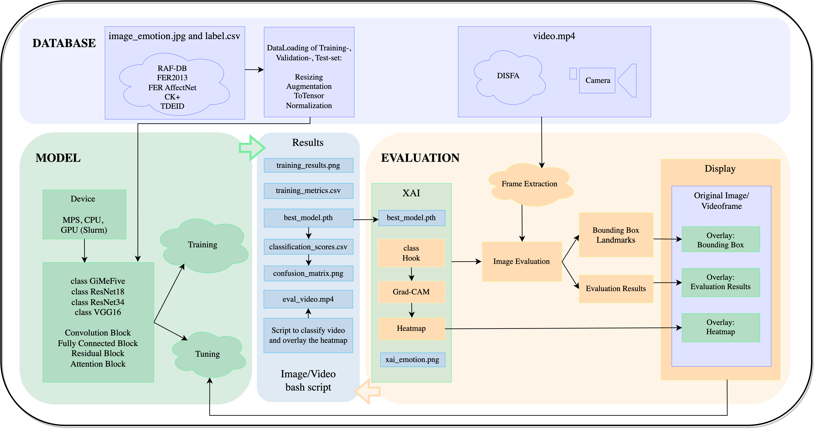
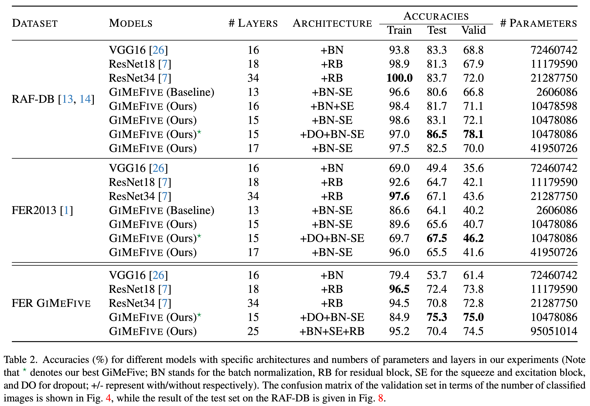

# GiMeFive✋: Towards Interpretable Facial Emotion Classification

<div align="center" style="text-align: center; white-space: nowrap;">
  <a href="https://github.com/werywjw/SEP-CVDL/blob/main/final/GIMEFIVE%3A%20Towards%20Interpretable%20Facial%20Emotion%20Classification.pdf">Paper PDF Version📄</a> &nbsp; | &nbsp;
  <a href="https://github.com/werywjw/SEP-CVDL/blob/main/presentation/SEP-CVDL.pdf">Presentation PDF Version🎥</a> &nbsp; | &nbsp;
  <a href="https://github.com/werywjw/SEP-CVDL/blob/main/proposal/Emotion%20Recognition%20From%20Facial%20Expressions%3A%20A%20Preliminary%20Report.pdf">Proposal PDF Version📃</a>
</div>

## Submission Index
- [x] Final Report ([GiMeFive: Towards Interpretable Facial Emotion Classification](https://github.com/werywjw/SEP-CVDL/blob/main/final/GIMEFIVE%3A%20Towards%20Interpretable%20Facial%20Emotion%20Classification.pdf))
- [x] requirements.txt ([requirements of packages for GiMeFive](https://github.com/werywjw/SEP-CVDL/blob/main/requirements.txt))
- [x] README.md ([README for GiMeFive](https://github.com/werywjw/SEP-CVDL/blob/main/README.md))
- [x] best_GiMeFive.pth ([saved GiMeFive model](https://github.com/werywjw/SEP-CVDL/blob/main/best_GiMeFive.pth))
- [x] script_csv.py ([script that iterates through folders and creates csv file](https://github.com/werywjw/SEP-CVDL/blob/main/script_csv.py))
- [x] script_csv.sh ([alternative script](https://github.com/werywjw/SEP-CVDL/blob/main/script_csv.sh))
- [x] script_video.py ([Script that classifies and saves videos and live camera streams](https://github.com/werywjw/SEP-CVDL/blob/main/script_video.py))
- [x] script_label.ipynb ([Jupiter Notebook for preprocess images and labels](https://github.com/werywjw/SEP-CVDL/blob/main/script_label.ipynb))
- [x] models.py ([GiMeFive and all sota models (VGG & ResNet)](https://github.com/werywjw/SEP-CVDL/blob/main/models.py))
- [x] train_eval.py ([Train and evaluate the models](https://github.com/werywjw/SEP-CVDL/blob/main/train_eval.py))
- [x] models_train_eval.ipynb ([Jupiter Notebook version](https://github.com/werywjw/SEP-CVDL/blob/main/models_train_eval.ipynb))
- [x] hook.py ([Class Hook for GradCAM and video](https://github.com/werywjw/SEP-CVDL/blob/main/hook.py))
- [x] plot_gcam.ipynb ([Jupiter Notebook for GradCAM visulization](https://github.com/werywjw/SEP-CVDL/blob/main/plot_gcam.ipynb))
- [x] plot_heatmap.ipynb ([Jupiter Notebook for Heatmap visulization](https://github.com/werywjw/SEP-CVDL/blob/main/plot_gcam.ipynb))
- [x] eval_video.ipynb ([Jupiter Notebook that classifies and saves videos and live camera](https://github.com/werywjw/SEP-CVDL/blob/main/eval_video.ipynb))
- [x] video.mp4 ([test video with no evaluation](https://github.com/werywjw/SEP-CVDL/blob/main/video/video.mp4))
- [x] eval_video.mp4 ([evaluated video](https://github.com/werywjw/SEP-CVDL/blob/main/eval_video.mp4))
- [x] haarcascade_frontalface_default.xml ([pretrained model of haar cascade](https://github.com/werywjw/SEP-CVDL/blob/main/haarcascade_frontalface_default.xml))
- [x] shape_predictor_68_face_landmarks.dat ([pretrained model of Landmarks](https://github.com/werywjw/SEP-CVDL/blob/main/shape_predictor_68_face_landmarks.dat))
- [x] slurm_jobs.sh ([script for slurm](https://github.com/werywjw/SEP-CVDL/blob/main/slurm/slurm_job.sh))
- [x] installed_packages.txt ([requirements of packages for slurm](https://github.com/werywjw/SEP-CVDL/blob/main/slurm/installed_packages.txt))

## Abstract

Deep convolutional neural networks have been shown to successfully recognize facial emotions for the past years in the realm of computer vision. However, the existing detection approaches are not always reliable or explainable, we here propose our model GiMeFive with interpretations, i.e., via layer activations and gradient-weighted class activation mapping. We compare against the state-of-the-art methods to classify the six facial emotions. Empirical results show that our model outperforms the previous meth- ods in terms of accuracy on two *Facial Emotion Recognition* (FER) benchmarks and our aggregated FER GiMeFive. Furthermore, we explain our work in real-world image and video examples, as well as real-time live streams.

## Overview



## Results



<!-- <p align="center">
  
   
</p> -->

## Requirements

A detailed list of requirements can be found in `requirements.txt`. 

```
pip install -r requirements.txt
python3 -m pip install -r requirements.txt
```

## How to run the script to get the CSV file of classification scores?
Please change the **filepath** to the image folder that you would like to try. 😄

- Option 1️⃣: Run the following command:
```
python3 script_csv.py 'data/valid'
```

- Option 2️⃣: Use shell:
```
./script_csv.sh
```

## How to run the script to generate an XAI video from a given video path or a camera stream? 🥹 📹

Run one of the following commands: 
```
python3 script_video.py -h

python3 script_video.py -s camera
python3 script_video.py -s video -i 'video/video.mp4'
```

## How does our video look like?

<p align="center">
  
   
</p>

## How to test the live demo with camera (old version)?

Run the following command:
```
python3 eval_livecam.py
```

Exit via `control` + `C`.

## Q&A

### Where is our paper (final report) 📄?

### Where are our presentation slides 🎥?

On [goolge docs](https://docs.google.com/presentation/d/14AazB5FY5jLyB5-9R6Ix7LoMX8yNR_illDAaYDCm8_s/edit#slide=id.g2b4d85efaed_0_31). 
The shared link is available [here](https://docs.google.com/presentation/d/14AazB5FY5jLyB5-9R6Ix7LoMX8yNR_illDAaYDCm8_s/edit?usp=sharing). 
The PDF Version is [here](https://github.com/werywjw/SEP-CVDL/blob/main/presentation/SEP-CVDL.pdf).

### Where is our proposal (preliminary report) 📃?

The PDF Version is [here](https://github.com/werywjw/SEP-CVDL/blob/main/proposal/Emotion%20Recognition%20From%20Facial%20Expressions%3A%20A%20Preliminary%20Report.pdf).

### What are the emotion labels?

😄 happiness (0)

😲 surprise (1)

😭 sadness (2)

😡 anger (3)

🤢 disgust (4)

😨 fear (5)

### How to generate a requirements.txt?
```
pipreqs /Users/wery/Desktop/SEP-CVDL
pip3 freeze > requirements.txt
```

### How to resolve the conflicts?
```
git status
```
See what is asked to be modified, then:
```
git add .
git pull 
git config pull.rebase false
git pull 
git commit
git push
```

### How to cite?

Typically [dblp](https://dblp.uni-trier.de) and [Google Scholar](https://scholar.google.com). 

### How to coauthor?

```
git add .
git commit -m "


Co-authored-by: leahkawka <leahkawka@gmail.com>"
git push origin main
```

Similarly, `command` + `enter` for blank lines:
```
git commit -m " <balala>


Co-authored-by: werywjw <werywjw@gmail.com>"
```

### How to convert `.ipynb` to `.py`?

```
colab-convert livecam.ipynb livecam.py -nc -rm -o
```

### How to convert `.mp4` to `.gif`?

Go to [ezgif webpage](https://ezgif.com/video-to-gif).

### How to create submodules?

```
git submodule add https://github.com/werywjw/data.git
```

### How to create the virtual environment?

```
source /Users/wery/venv/bin/activate
```

## Notes on Slurm

1. get your CIP account information 
2. activate romote access
3. git bash (ssh included) on windows / go to Terminal on MacBook
4. Login to remote host: (e.g., name lachen) command:
```
ssh <cip-kennung>@remote.cip.ifi.lmu.de
```
 + password
ok everthing

5. command:
```
sinfo | grep Nvidia2060
```

6. go to Nvidia2060 host, get there by picking one of the names listed after idle 
command: 
```
ssh <cip-kennung>@<server_name>
```
(e.g., ssh <cip-kennung>@chondrit, ssh <cip-kennung>@idle) asked to type yes + enter password

7. to get information of the server architechtur, 
Linux terminal command: lsb_release -a
get info of graphiccard command: nvidia-smi
list of python versions: 
<cip-kennung>@chondrit:~ (0) [15:43:07] % python --version  
Python 2.7.18  
<cip-kennung>@chondrit:~ (0) [15:45:06] % python3 --version  
Python 3.8.10  
information systemworkload command: htop 
exit: q

8. exit the server by command:
```
exit
```

9. exit the remote host by command:
```
exit
```
